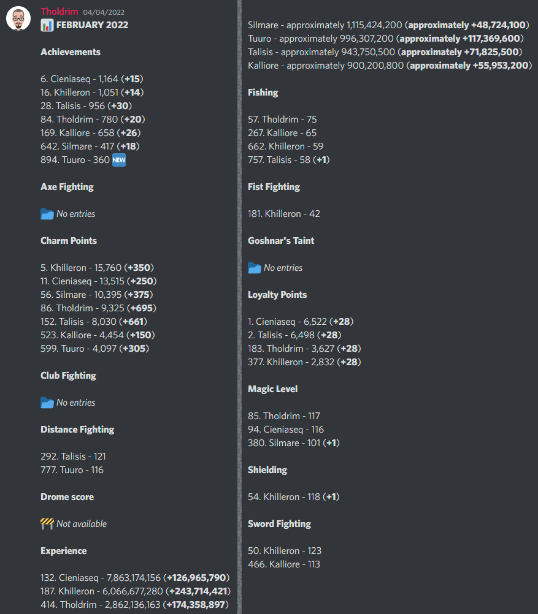

# TibiaResults 



TibiaResults is a tool initially created to generate monthly summaries of my buddies' progress in the MMORPG [Tibia](https://www.tibia.com). Such a set of statistics allows us to compare our performance and motivate each other to work harder.

The program was written in C# for the .NET platform, so it should run on any recent operating system. It relies on data in the format returned by the [TibiaData API v3](https://tibiadata.com). I primarily used a simple Azure Logic App to retrieve and save such files every first day of the month, but nothing prevents you from obtaining this data in other ways or at different frequencies.

<br clear="right" />

## Prerequisites

TibiaResults requires the [.NET 6.0](https://dotnet.microsoft.com/en-us/download/dotnet/6.0) platform to run. If you intend to run the program on Windows, download the appropriate version of the .NET runtime and binaries from the [Releases](https://github.com/Tholdrim/TibiaResults/releases) feed. Otherwise, you will have to download the SDK and build the application yourself.

## Usage

The first step is to get the JSON files from the TibiaData API page (for testing purposes, you can also use the included [sample data](Sample%20data) with Refugia server high score lists). These should be saved locally on disk or in an Azure Blob container in the format `{category}/{yyyy-MM-dd}.json`. Next, populate the [`Settings.json`](Source/TibiaResults/Settings.json) file with the appropriate values, e.g.:

```
{
    "localPath": "C:/Highscores"
    "characters": [
        "Tholdrim",
        "Khilleron",
        "Tuuro",
        "Silmare",
        "Kalliore",
        "Cieniaseq",
        "Talisis"
    ],
    "from": "2022-02-01",
    "to": "2022-03-01"
}
```

Once everything is ready, you can run the program.

## Results

All characters that are present in the high score list for a given category will be listed with their position on the server, current score, and progress against the previous value. Special treatment is given to the Experience category, where the program tries to find an approximate number of experience points based on the other high score lists if the character has too low a level to be included in the official ranking.

If a file representing the current or previous high score list is missing for any particular category, the *Not available* message will be returned instead.

## Customization

The display order and names of each category are defined in the [`Categories.cs`](Source/TibiaResults/Consts/Categories.cs) file, while the [`CategoryHelper.cs`](Source/TibiaResults/Helpers/CategoryHelper.cs) file is used to specify a subset of the categories that the program should process. By modifying these two files, you can change these settings.

By default, there are two ways to load stored data: from an Azure Blob container or a local folder, and one way to format the results: as the [Discord](https://discord.com) message content. To add more features, implement the [`IHighscoreProvider`](Source/TibiaResults/Interfaces/IHighscoreProvider.cs) or [`IResultFormatter`](Source/TibiaResults/Interfaces/IResultFormatter.cs) interfaces.

## License

It is open-source software licensed under the MIT License. See the [LICENSE.txt](LICENSE.txt) file for more details.
